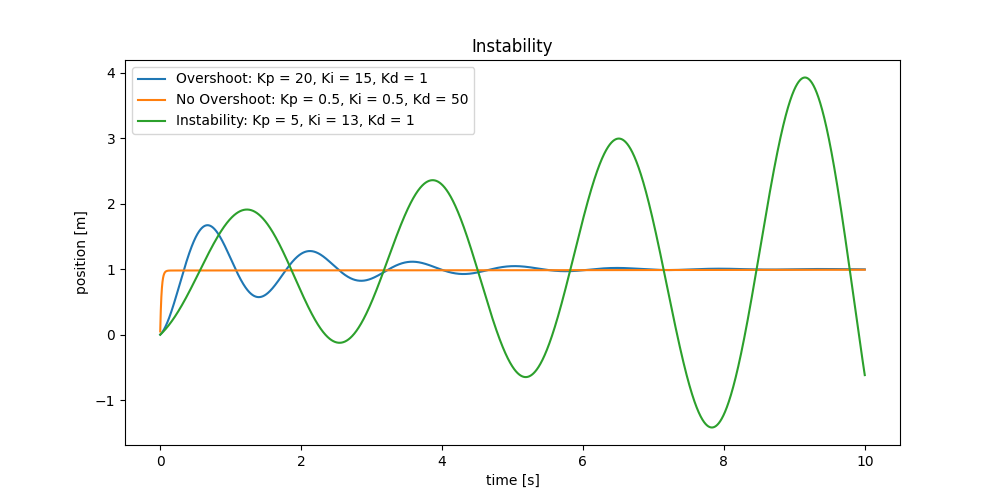
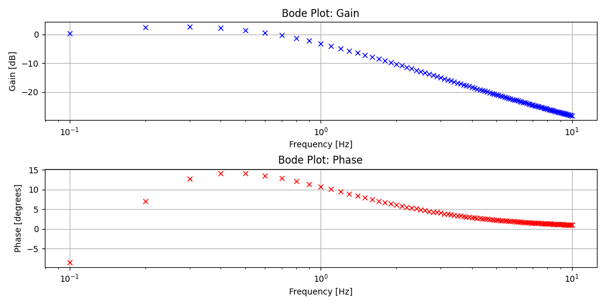

# Planar Robotic Manipulator Control - TU Delft Assignment

## Overview

This repository contains code and resources for building and controlling a planar robotic manipulator. The objectives of this assignment are as follows:

1. Create and tune PID controllers.
2. Analyze PID-controlled plants using control theory, focusing on frequency response with empirical Bode plots.
3. Derive kinematic models (forward kinematics and Jacobian) and implement a singularity-robust endpoint position controller.
4. Create a task-priority controller to simultaneously control two endpoints.
5. Derive dynamic models using the Lagrangian method and implement an impedance controller.

## Usage

### Dependencies

```bash
pip install -r requirements.txt
```

### Running the Code

```bash
python PA1a.py
```


## Project Structure

The repository is structured around several Python templates, each corresponding to different parts of the assignment:

- `PA1a.py`: 1-DoF mass-damper system controlled by PID.
- `PA1b.py`: Frequency response analysis of the 1-DoF system.
- `PA1c.py`: Kinematic control of a 2-DoF robotic arm.
- `PA1d.py`: Task-priority control of a 4-DoF robotic arm.
- `PA1e.py`: Dynamic control of a 2-DoF torque-controlled robotic arm.

### `PA1a.py`
This Python script simulates a 1-Degree-of-Freedom (1-DoF) mass-damper system. It provides a framework for implementing PID controllers to actuate the system. The PID controllers are tuned to achieve specific step responses, including overshoot, no overshoot, and instability.



### `PA1b.py`
Expanding upon `PA1a.py`, this file aims to analyze the frequency response of the 1-DoF mass-damper system. It allows to empirically sample gains and phase shifts of the system and plot Bode plots.



### `PA1c.py`
This script focuses on a 2-DoF position-controlled robotic arm. It requires the derivation and implementation of forward kinematics and the Jacobian matrix to create a singularity-robust endpoint position controller.

This is done using the kinematics to get endpoint position, comparing it to the desired position, and then computing the joint velocities $dq$ to minimize this error.

### Forward Kinematics
The forward kinematics equations for a 2-DOF planar robot are:

$$
\begin{aligned}
p_x &= l_1 \cos(q_1) + l_2 \cos(q_1 + q_2) \\
p_y &= l_1 \sin(q_1) + l_2 \sin(q_1 + q_2)
\end{aligned}
$$

### Jacobian Matrix
The Jacobian matrix $J$ for this robot would be:

$$
J = \begin{bmatrix}
-\sin(q_1)(l_1 + l_2) - \sin(q_1 + q_2)l_2 & -\sin(q_1 + q_2)l_2 \\
\cos(q_1)(l_1 + l_2) + \cos(q_1 + q_2)l_2 & \cos(q_1 + q_2)l_2
\end{bmatrix}
$$

### Kinematic Control
A simple PID controller can be used to compute $dq$ based on the error between the desired and current endpoint positions $e = p_{\text{ref}} - p$.

$$
dq = J^{-1}(K_p e + K_i \int e \, dt + K_d \frac{d}{dt} e)
$$

However, directly inverting $J$ may lead to issues near singularities. A damped-least squares approach can be used instead:

$$
dq = (J^T J + \lambda^2 I)^{-1} J^T(K_p e + K_i \int e \, dt + K_d \frac{d}{dt} e)
$$

Here, $\lambda$ is the damping factor.

### `PA1d.py`
This file deals with a 4-DoF position-controlled robotic arm. It uses task-priority control algorithms to simultaneously control two endpoints. It builds upon the kinematic models derived in `PA1c.py`.

### `PA1e.py`
This is the most advanced script, focusing on a 2-DoF torque-controlled robotic arm. It involves deriving a dynamic model using the Lagrangian method and implementing an impedance controller to control the arm.
